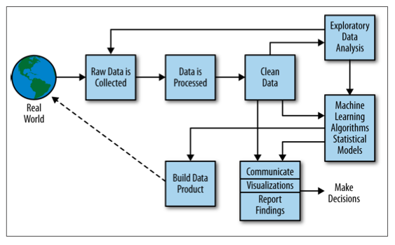

```{r setup, include=FALSE}
knitr::opts_chunk$set(echo = TRUE)
```

## 1.1 Data Science Workflows

This data science tutorial spans the entire data science workflow or process. A common version of this process is illustrated by:   

  

This diagram is taken from [Doing Data Science](http://shop.oreilly.com/product/0636920028529.do) by Cathy O'Neil and Rachel Schutt.

This tutorial initially will focus on the items along the top, i.e., raw data is collected, data is processed, and data is cleaned. Exploratory data analyses will also be covered. We then cover the box on the right---machine learning algorithms and statistical models (see below). We also cover data visualization in the lower right box. Ultimately, the purpose of data science is to build data products at scale, but this tutorial does not (yet) cover this topic.  


Hadley Wickham has a more abbreviated and specific version of the data science workflow in his book: [R for Data Science](http://r4ds.had.co.nz/introduction.html#what-you-will-learn).


Hadley's workflow is based on functions which use tibbles---a type of data frame amenable to big, rectangular data---as inputs and outputs, much like UNIX pipes use standard input and standard output. This functionality is captured in a collection of packages called the tidyverse, which is also an R package of the same name. The `tidyverse` package automatically loads many of the common tidyverse-compatible packages.

We focus on on certain R packages in the tidyverse, e.g., `tidyr` to clean data, `dplyr` for transforming the data, `ggplot2` for visualization, `modelr` and `broom` for modeling, and various import packages among others. We use R markdown and R notebooks for communicating results, which may contain embedded graphics based on packages such as `ggplot2`. We will often be using Hadley's approach in this tutorial.  

### 1.1.1 Data Science Environments  

Data science requires a number of computing environments to analyze and visualize large, complex data derived from a variety of sources. For the most part, data science is built on open-source software, an approach we use here. The principal software environments used are R and Spark. I use the word "environment" here to mean extensibility, primarily through packages. However, R and Spark are more appropriately called  ecosystems since each has a large numbers of supporting components, such as the database PostgreSQL. 

We choose R (rather than Python) as a high-level programming language, partly because it is a highly-developed statistical programming environment, but primarily since it is a functional language. This makes R adept at building data workflows using R's pipe operator, `%>%`, for data manipulation and machine learning (ML) workflows.

R has a vast collection of functions and packages for doing almost anything with any type of data. Due to initial design trade-offs, R (and Python) use a single-core execution engine. There are many ways to parallelize R for scientific purposes, and this capability has now been extended to Spark. Not only has R been integrated into Spark, but many R packages can be run within Spark.

Spark has become the *de facto* standard for data science, just as R has become the *de facto* standard for statistical computing. Spark has a rapidly growing ecosystem, but a more limited package system than R. 

### 1.1.2 rspark: a Platform for Data Science

For our purposes a platform should have all the components needed to do data science. There are two choices: a pre-built commercial distribution, e.g., Cloudera, or an open-source distribution. Cloudera is an excellent distribution and is feature complete. However, it does require a substantial amount of support for deployment and maintenance. In addition, running Cloudera on a physical cluster limits its flexibility, particularly for a teaching environment.

The trend is towards deploying software using [Docker containers](https://www.docker.com/). Docker allows applications and their dependencies to run in virtual containers using Linux as the base OS. An excellent repository exists for Dockerized versions of R called [rocker](http://github.com/rocker-org/rocker). We use the rocker image `verse` which adds the `rstudio`, `tidyverse`, and `verse` layers to the `r-ver` image, which in our deployment is based on R 3.6.3.

We built `rspark` to extend `rocker` to the Spark ecosystem. The GitHub repo for `rspark` can be found [here](http://github.com/jharner/rspark). `rspark` consists of containers for RStudio, PostgreSQL, Hadoop, and Hive. Spark is installed in the RStudio container by default, but optionally Spark can be run on a master and two workers. The former approach has a smaller footprint and is often adequate for teaching.
