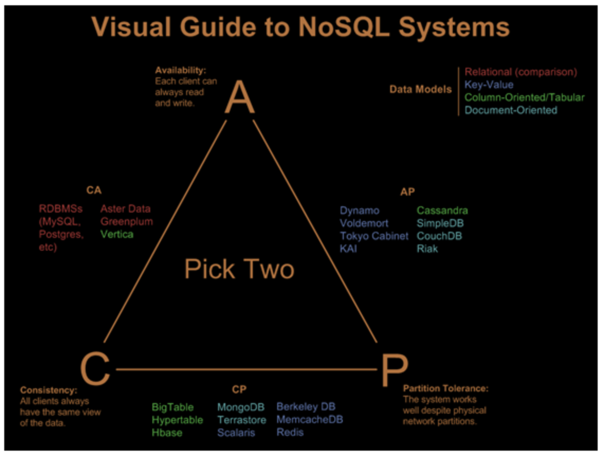

```{r setup, include=FALSE}
knitr::opts_chunk$set(echo = TRUE)

library(RPostgreSQL)

host.name <- "postgres" # for Docker deployment
# host.name <- NULL     # for AWS deployment
```

## 2.5 Databases

This section introduces relational data base management systems and NoSQL databases. The relational model is essential for multi-user transactional data, but it does not scale for big data. NoSQL databases are often distributed across a cluster.

Two concepts are central to databases, but unfortunately are [ambiguous](http://blog.thislongrun.com/2015/03/the-confusing-cap-and-acid-wording.html).  

* ACID (Atomicity, Consistency, Isolation, and Durability) is central to relational databases, whereas  
* CAP (Consistency, Availability, and Partition Tolerance) as well as ACID are important for distributed databases. 

The exploration of these topics is left as a discussion topic.

### 2.5.1 RDBMS

Content in this section is based partly on material in Paul Murrell's [Introduction to Data Technologies](https://www.stat.auckland.ac.nz/~paul/ItDT/).

A *relational data base management system* (RDBMS) is based on Codd's *relational model* (RM), which in turn is based on *relational algebra*. It uses Structured Query Language (SQL) as a query language. 

A single logical operation on a database is called a *transaction*. A single transaction can involve multiple changes, e.g., debiting one account and crediting another when funds are transferred in a bank. To perform these operations safely, certain properties must be met.

RDBMS should maintain the ACID properties:  

* Atomicity: transactions are all or nothing;  
* Consistency: transactions bring the database from one valid state to another;  
* Isolation: concurrent transactions maintain state as if they are serial transactions;  
* Durability; a committed transaction maintains state even if there are crashes, power failures, etc.  

We will be using PostgreSQL an open source DBMS that is stable and feature rich. PostgreSQL has a command-line interface for making queries called `psql`. 

We have several built in databases on our PostgreSQL server---`gofirstsql` and `dataexpo`.

The Data Expo data set consists of seven atmospheric measurements at locations on a 24 by 24 grid averaged over each month for six years (72 time points). The elevation (height above sea level) at each location is also included in the data set.

The table schema for `dataexpo` is defined as follows.
```
date_table ( ID [PK], date, month, year )

location_table ( ID [PK], longitude, latitude, elevation )

measure_table ( date [PK] [FK date_table.ID],
                location [PK] [FK location_table.ID],
                cloudhigh, cloudlow, cloudmid, ozone,
                pressure, surftemp, temperature )
```

We connect to PostgreSQL through the R package `RPostgreSQL`.

Ordinarily, we would use:
```{r}
library(RPostgreSQL)

tryCatch({
  drv <- dbDriver("PostgreSQL")
  con <- dbConnect(drv, host = host.name, dbname='dataexpo')

  dbListConnections(drv)

  dbListTables(con)
  dbListFields(con, "location_table")

# more R code
},
finally = {
  dbDisconnect(con)
  dbUnloadDriver(drv)
})
```
This provide safe coding in case there is a network problem. However, in order to get printed output beyond the last statement in the `tryCatch` function, we will use regular R code.

```{r}
drv <- dbDriver("PostgreSQL")
con <- dbConnect(drv, host = host.name, dbname = 'dataexpo')

dbListConnections(drv)

dbListTables(con)
dbListFields(con, "location_table")

# dbGetQuery returns a data.frame which can be used directly
meas <- dbGetQuery(con, "select * from location_table")
class(meas)
head(meas)
rm(meas)
```
We use `dbGetQuery` here to select all columns from the `location_table` and return the results in a data frame.

We now consider an alternative approach to select the data from the `location_table`.
```{r}
# dbSendQuery returns a PostgreSQLResult
measures <- dbSendQuery(con, "select * from location_table")
dbGetStatement(measures)
# We can then fetch directly from the PostgreSQLResult
fetch(measures, n=10)

# The default number of records to retrieve is 500 per fetch
while (!dbHasCompleted(measures)) {
  chunk <- fetch(measures, n=50)
  print(nrow(chunk))
}

class(measures)
dbClearResult(measures)

# n=-1 fetches all the remaining records
# dbFetch(measures, n=-1)
```
In principle, it would be possible to extract data from the tables of interest and use R functions to join as needed. However, this would be far less efficient than selecting directly from the database. The following example illustrates this.

Suppose we want to plot the average temperature (Kelvin) vs. the base elevation. First, we extract `surftemp` and then average and `elevation` grouped by multiples of 500. The required `select` statement involves joins, grouping, etc.
```{r}
temp.avgs <- dbGetQuery(con,
    "select round(l.elevation/500)*500 base_elev, avg(m.surftemp) avg_temp
    from measure_table m
    join location_table l on m.location = l.id 
    join date_table d on m.date = d.id
    where d.year = 1998 
    group by base_elev 
    order by base_elev")
temp.avgs

dbDisconnect(con)
dbUnloadDriver(drv)
```
I am assuming you have basic knowledge of `select`. We use `dbGetQuery` in order to get the data frame directly---in this case `temp.avgs`.

Now plot the data frame.
```{r}
plot(temp.avgs, type="l",
  xlab="Base Elevation (feet)", ylab="Average Temperature(Kelvin)",
  main=" Avg Temperature by Elevation")
```

As the base elevation increases, the average temperature tends to decrease as expected.

### 2.5.2 NoSQL Databases

NoSQL (Not only SQL) databases are widely used when storing big data and real-time data. NoSQL databases:  

* are not based on the relational model;  
* perform well on clusters;  
* do not have a fixed schema;  
* are usually open source;  
* are specialized for web applications and big data.  

Some NoSQL databases support a SQL-like query language.

Why NoQSL? SQL databases:  

* have an impedance mismatch between the relational model and the application model;  
* do not run well on clusters.

It would be impossible to run Web 2.0 companies, e.g., Google, Facebook and Twitter, using a RDBMS.

#### CAP Theorem

All disturbuted systems, including distributed databases, are subject to network failures. As a result, network partitioning can occur, which means the database designer must choose between consistency or availability.

The CAP theorem, or Brewer's theorem, states that it is impossible for a distributed database to simultaneously provide all three of the following guarantees:

* Consistency (C): every read receives the most recent write or an error;  
* Availability (A): every request receives a response, without guarantee that it contains the most recent version of the information;  
* Partition tolerance (P): the system continues to operate despite arbitrary partitioning due to network failures.  

Basically, you can choose any two, but cannot have all three. In reality you are choosing between A and C. Note: consistency in CAP is not the same as consistency in ACID.


AC is really the realm of relational databases that also meet the ACID requirements. Vertica is an in-database analytical engine that uses column-based storage.

#### Data Distribution

Two models are used for distributing data across a cluster.  

* sharding: segment the data by primary key into shards, each stored on a separate node.  
* replication: copy all data to multiple servers either as master-slave or peer-to-peer. 

The following are possibilities:

* CA: uses a 2-phase commit with a block system (only possible in a single data center);  
* CP: uses shards, but there is some risk of data becoming unavailable if a node fails.

#### NoSQL Data Models

The following are the NoSQL database types:  

* Key-value  
    + Simplest API (get, put, delete, etc.)  
    + Data in a blob  
    + Not necessarily persistent  
* Document  
    + Similar to key-value, but with values in a known format  
    + Structured data, e.g., JSON, BSON, or XML  
    + Not necessarily persistent  
* Column-family  
    + Many columns associated with each row key  
    + Column families (similar to tables) related and often accessed together
* Graph  
    + Entities and their relationships stored  
    + Properties associated with entities  
    + Properties and direction significance associated with edges  
    + Easy transversal of relationships  
    
Examples of NoSQL databases:  

* Key-value: Riak (AP), memcacheDB (CP), Redis (CP) 
* Document: CouchDB (AP), MongoDB (CP)  
* Column-family: Cassandra (AP), HBase (CP)  
* Graph: Neo4J, Infinite Graph  

A vs. C is really only an issue if there is a network failure or communications issue. Some would argue that CAP is too simplistic.

Why choose NoSQL? To improve:  

* programmer productivity;
* data access performance by handling larger data sets, reducing latency, and/or improving throughput.

Selecting a NoSQL database:  

* Key-value is used for session information, preferences, profiles, and shopping carts, i.e., data without relationships.  
* Document databases are for content management, real-time analytics, and ecommerce. Avoid when aggregate data is needed.  
* Column family databases are useful for write-heavy operations like logging.  
* Graph databases are optimal for social networks, spacial data, and recommendation engines. 

Selecting a NoSQL database depends on the application use cases and should be tested before deployment. We will focus on HBase, a column-family, key-value data store, that runs on HDFS. HBase tables can serve as inputs and outputs for MapReduce jobs (see Section 4.4). 

#### Aggregate Data Models

Apache Hive is a data warehouse built on top of Hadoop's HDFS (Hadoop Distributed Filesystem) for data querying and data summarization. Although Hive tables are distributed over a cluster, the data is stored in RBDMS format. Hive typically works with aggregated data grouped by units. Hive supports a SQL-like query language called HiveQL, which converts queries to MapReduce and Spark jobs. Inter-aggregate relationships are handled via MapReduce operations. Transactions are ACID compliant, but with restrictions due to Hadoop's lack of support for row-level updates. For further discussion see Section 4.4.
