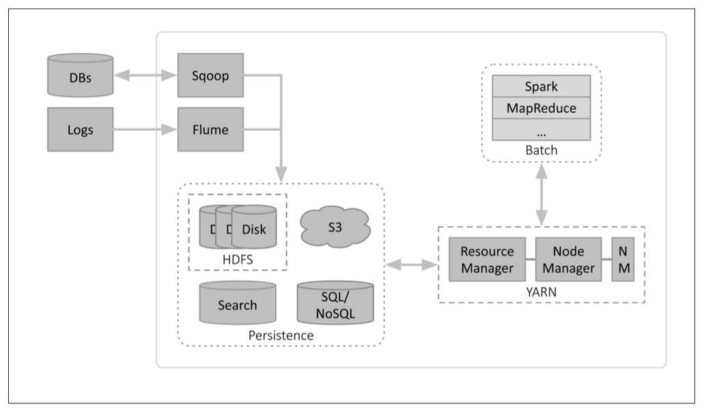
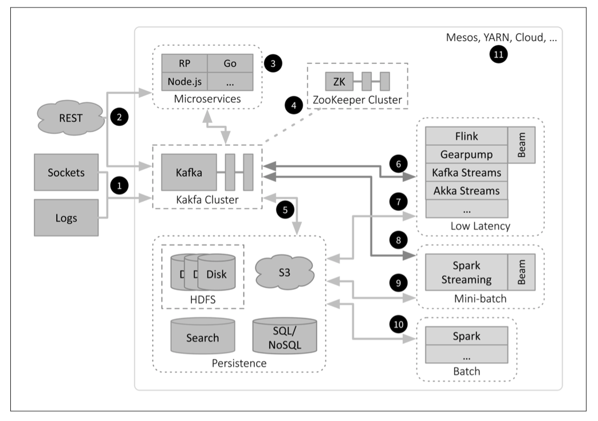

```{r setup, include=FALSE}
knitr::opts_chunk$set(echo = TRUE)
```

## 4.1 Hadoop

Hadoop is an open-source framework for large-scale data storage and distributed computing, built on the MapReduce model. Doug Cutting created Hadoop as a component of the Nutch web crawler. It became its own project in 2006, and graduated to a top-level Apache project in 2008.

It is a general framework, applicable to a variety of domains and programming languages. One use case is to drive large R jobs.

An overview of the Hadoop ecosystem as implemented in the Hortonworks Data Platform (HDP) is given here: [Hortonworks Data Platform](https://www.cloudera.com/products/hdp.html). It is based on a centralized architecture (YARN). Hadoop supports many technologies built on YARN, including MapReduce and Spark.

Batch data is collected and ingested into HDFS using Flume or Sqoop. Analysis jobs, written in Hadoop MapReduce, Spark, or other tools, are submitted to the Resource Manager for YARN, which decomposes each job into tasks that are run on the worker nodes, managed by a Node Manager. Even for interactive tools like Hive and Spark SQL, the same job submission process is used when the actual queries are executed as jobs. See O'Reilly's [Fast Data Architectures for Streaming Applications](http://www.oreilly.com/data/free/fast-data-architectures-for-streaming-applications.csp), which contrasts batch processing with stream processing.



Our Docker containers approximate this batch architecture, but lacks certain components at this time.

Hadoop's primary use is for big-data tasks involving extract-transform-load (ETL), image processing, data modeling, machine learning, etc.

The Hadoop ecosystem is generally used for data-at-rest, but it also supports data-in-motion. This allows real-time data to be collected and analyzed, e.g., sensor data and log files. This is becoming increasingly important due to the rise of the Internet of Things (IoT). Streaming data is collected and ingested into HDFS or sent directly to a stream processing engine using Kafka, a real-time messaging system, for analysis and rendering using tools such as Spark Streaming or Flink.



Both the batch and streaming architectures will be discussed in more depth, but I suggest you read the O'Reilly publication mentioned above. A somewhat different approach is presented in O'Reilly's [The Path to Predictive Analytics and Machine Learning](http://www.oreilly.com/data/free/the-path-to-predictive-analytics-and-machine-learning.csp)

This streaming architecture is not feasible at this time due to resource limitations. Within an educational setting it is probably best implemented using [Docker containers](https://www.docker.com) scaled and orchestrated by [kubernetes](http://kubernetes.io). For a start in this direction see: [jharner/rspark](https://github.com/jharner/rspark).

The [Cloudera distribution](http://www.cloudera.com/products/apache-hadoop.html) is more useful at this time due to its support of `sparklyr`. In many ways the Hortonworks and Cloudera distributions are similar, but the support tools are specific to the platform. Cloudera also supports [data in motion](http://www.cloudera.com/campaign/data-in-motion.html).

Hadoop is also a framework for parallel processing for compute intensive tasks. The idea is to:  

* decompose a problem into independent units of work;  
* distribute the work across a cluster of machines. 

Hadoop is based on three principal components:    

* the *Hadoop Distributed File System* (HDFS);  
* the *data operating system* (YARN);  
* the *MapReduce model*.  

These Hadoop components will be discussed along with several supporting systems.